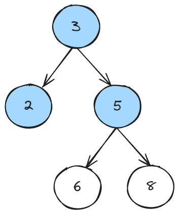

author: Jean-Dv
summary:
id: treeset
tags: code java data-structures
categories: code
environments: Web
status: Published
feedback link: https://github.com/Jean-Dv/codelabs-treeset/blob/master/markdown/treeset

# Treeset Data Structure

## Método `add(O object)`

Duration: 0:01:00

### Paso a paso

El método `add` se utiliza para agregar un elemento al conjunto o colección.
Aquí explicaremos cómo funciona visualmente paso a paso:

#### Paso 1: Inserción del primer elemento

Supongamos que tenemos un TreeSet vacío y queremos agregar el elemento "C".
En este caso, el árbol se vería así:


#### Paso 2: Inserción del segundo elemento

Ahora, si queremos agregar el elemento "A", se compara con el elemento
existente ("C") y se decide que "A" es menor, por lo que se coloca
a la izquierda:


#### Paso 3: Inserción del tercer elemento

Añadimos el elemento "B", que es mayor que "A" pero menor que "C", por lo que
se coloca a la derecha de "A" y a la izquierda de "C":


### Complejidad temporal:

La complejidad temporal de `add` en un TreeSet es O(log N), donde N es el número
de elementos en el conjunto. Debido a la estructura del árbol de busqueda binaria,
las inserciones se realizan eficientemente.

### Ejemplo de código:

```java
import java.util.TreeSet;

public class TreeSetExample {
    public static void main(String[] args) {
        // Crear un TreeSet
        TreeSet<String> treeSet = new TreeSet<>();

        // Agregar elementos usando el método add
        treeSet.add("C");
        treeSet.add("A");
        treeSet.add("B");

        // Mostrar el TreeSet
        System.out.println("TreeSet: " + treeSet);
    }
}
```

### Conclusión:

El método `add` mantiene la propiedad de orden en el TreeSet, asegurando que
los elementos se ubiquen correctamente en el árbol.

## Método `addAll(Collection<? extends E> c)`

Duration: 0:01:00

### Paso a paso

#### Paso 1: Creación de TreeSet y Collection

```java
import java.util.TreeSet;
import java.util.ArrayList;
import java.util.Collection;

public class TreeSetExample {
    public static void main(String[] args) {
        TreeSet<String> treeSet = new TreeSet<>();
        treeSet.add("A");
        treeSet.add("B");
        treeSet.add("C");
        Collection<String> collection = new ArrayList<>();
    }
}
```

#### Paso 2: Agregar elementos a la colección

```java
collection.add("D");
collection.add("E");
collection.add("F");
```

#### Paso 3: Uso del método `addAll`

```java
treeSet.addAll(collection);
```

### Funcionamiento en un árbol de busqueda binaria

Antes de ejecutar el método `addAll`, el árbol se ve así:


Después de ejecutar el método `addAll`, el árbol se ve así:


### Complejidad temporal:

La complejidad temporal de addAll en un TreeSet depende de la cantidad de
elementos en la colección a agregar. Si la colección tiene N elementos,
la complejidad sería O(N \* log N).

### Conclusión:

El método addAll permite agregar todos los elementos de una colección al TreeSet,
manteniendo la propiedad de orden en el árbol de búsqueda binaria.

## Método `ceiling(E e)`

Duration: 00:01:00

### Paso a paso:

#### Paso 1: Creación del Treeset y agrega elementos

```java
import java.util.TreeSet;

public class TreeSetExample {
    public static void main(String[] args) {
        // Crear un TreeSet
        TreeSet<Integer> treeSet = new TreeSet<>();

        // Agregar elementos al TreeSet
        treeSet.add(5);
        treeSet.add(2);
        treeSet.add(8);
        treeSet.add(3);
        treeSet.add(6);
    }
}
```

#### Paso 2: Uso del método `ceiling(E e)`

```java
 // Obtener el elemento igual o mayor al elemento especificado
Integer ceilingElement = treeSet.ceiling(4);

// Imprimir el elemento obtenido (o null si no hay elemento mayor o igual)
System.out.println("Elemento igual o mayor a 4: " + ceilingElement);
```

### Funcionamiento del método:

El método `ceiling(e)` devuelve el elemento igual o mayor al elemento especificado (e). En este caso, dado que hemos agregado los números 5, 2, 8, 3 y 6, el elemento igual o mayor a 4 es 5.

Resultado esperado:

```java
Elemento igual o mayor a 4: 5
```

### Conclusión:

El método `ceiling(e)` es útil para encontrar el primer elemento igual o mayor al valor especificado en el conjunto.

### Nota adicional:

- Si no hay un elemento igual o mayor al especificado, el método devuelve null.
- Este método puede ser especialmente útil cuando se necesita encontrar el siguiente elemento más grande o igual en un conjunto ordenado.

## Método `clear()`

Duration: 00:01:00

### Paso a paso:

### Paso 1: Creación del Treeset y agrega elementos

```java
import java.io.*;
import java.util.TreeSet;

public class TreeSetDemo {
    public static void main(String args[])
    {
        // Creating an empty TreeSet
        TreeSet<String> tree = new TreeSet<String>();

        // Use add() method to add elements into the Set
        tree.add("Welcome");
        tree.add("To");
        tree.add("Geeks");
        tree.add("4");
        tree.add("Geeks");
        tree.add("TreeSet");

        // Displaying the TreeSet
        System.out.println("TreeSet: " + tree);
    }
}
```

#### Paso 2: Uso del método `clear()`

```java
	 // Clearing the TreeSet using clear() method
        tree.clear();

        // Displaying the final tree
        System.out.println("After clearing TreeSet: " + tree);
    }
```

### Funcionamiento del método:

se utiliza para eliminar todos los elementos de un TreeSet. El uso del método clear() solo borra todo el elemento del conjunto y no elimina el conjunto.

Resultado esperado:

```java
TreeSet: [4, Geeks, To, TreeSet, Welcome]
After clearing TreeSet: []
```

### Conclusión:

- El propósito principal es proporcionar una forma conveniente de vaciar completamente el conjunto, eliminando todos los elementos existentes.

- Este método es útil cuando se desea restablecer o reiniciar el conjunto, y su invocación resultará en un conjunto vacío.

### Funcionamiento en un árbol de busqueda binaria

Arbol normal sin aplicar el metodo


Arbol depues del metodo clear()


## Método `clone()`

Duration: 00:01:00

### Paso a paso:

### Paso 1: Creación del Treeset y agrega elementos

```java
import java.io.*;
import java.util.TreeSet;

public class TreeSetDemo {
    public static void main(String args[]) {
        // Creating an empty TreeSet
        TreeSet<String> tree = new TreeSet<String>();

        // Use add() method to add elements into the Set
        tree.add("Welcome");
        tree.add("To");
        tree.add("Geeks");
        tree.add("4");
        tree.add("Geeks");
        tree.add("TreeSet");

        // Displaying the TreeSet
        System.out.println("TreeSet: " + tree);
   }
}
```

#### Paso 2: Uso del método `clone()`

```java
	 // Creating a new cloned set
        TreeSet cloned_set = new TreeSet();

        // Cloning the set using clone() method
        cloned_set = (TreeSet)tree.clone();
    }
```

### Paso 3:imprimir en la consola el contenido del TreeSet clonado

// Displaying the cloned_set
System.out.println("The cloned TreeSet: " + cloned_set);

### Funcionamiento del método:

Se utiliza para devolver una copia superficial del conjunto de árboles mencionado. Simplemente crea una copia del conjunto.

Resultado esperado:

```java
TreeSet: [4, Geeks, To, TreeSet, Welcome]
The cloned TreeSet: [4, Geeks, To, TreeSet, Welcome]
```

Devuelve clon de la lista ingresada

### Conclusión:

- Se crea un nuevo 'TreeSet', pero los elementos dentro de este nuevo conjunto son los mismos objetos que los del conjunto original.No se clonan los elementos en sí.

### Nota adicional:

- Dado que no se clonan los elementos, si se modifican los elementos en el conjunto clonado, esos cambios también se reflejarán en el conjunto original y viceversa.

### Funcionamiento en un árbol de busqueda binaria

(img/clone.png)


## Método `comparator()`

Duration: 00:01:00

### Paso a paso:

#### Paso 1: Creación de TreeSet con comparador personalizado

```java
import java.util.TreeSet;
import java.util.Comparator;

public class TreeSetExample {
    public static void main(String[] args) {
        // Crear un TreeSet con comparador personalizado (orden inverso)
        TreeSet<String> treeSet = new TreeSet<>(Comparator.reverseOrder());

        // Agregar elementos al TreeSet
        treeSet.add("C");
        treeSet.add("A");
        treeSet.add("B");
    }
}
```

#### Paso 2: Uso del método `comparator`

```java
Comparator<String> comparator = treeSet.comparator();
System.out.println("Comparador: " + comparator);
```

### Funcionamiento del método:

En este ejemplo, el comparador utilizado es `Comparator.reverseOrder()`, lo que significa
que los elementos se ordenarán en orden inverso al orden natural.

Resultado esperado:

```java
Comparador: java.util.Collections$ReverseComparator@hashcode
```

### Conclusión:

- Si se utiliza un comparador personalizado, el método `comparator` devolverá ese comparador
- Si no se proporciona un comparador al crear el `TreeSet`, el método `comparator` devolvera `null`, indicando que se está utilizando el orden natural de los elementos.

### Nota adicional:

Si el conjunto se creó utilizando el orden natural de los elementos, `comparator` devolverá
`null`.

## Método `contains(Object o)`

Duration: 00:01:00

### Paso a paso:

### Paso 1: Creación del Treeset y agrega elementos

```java
import java.io.*;
import java.util.TreeSet;

public class TreeSetDemo {
    // Importing required classes
import java.io.*;
import java.util.TreeSet;

// Main class
public class GFG {

    // Main driver method
    public static void main(String args[])
    {

        // Creating an empty TreeSet of string type
        TreeSet<String> tree = new TreeSet<String>();

        // Adding elements in TreeSet
        // Using add() method to
        tree.add("Welcome");
        tree.add("To");
        tree.add("Geeks");
        tree.add("4");
        tree.add("Geeks");
        tree.add("TreeSet");

        // Displaying the TreeSet
        System.out.println("TreeSet: " + tree);
   }
}
```

#### Paso 2: Compruebe si hay un elemento específico en el TreeSet anterior

             usando el método contains() de la clase TreeSet

```
// Printing a boolean value
        System.out.println(
            "Does the Set contains 'TreeSet'? "
            + tree.contains("TreeSet"));
    }
}
```

### Funcionamiento del método:

se utiliza para comprobar si un elemento específico está presente en el TreeSet o no. Así que, básicamente, se utiliza para comprobar si un TreeSet contiene algún elemento en particular.

Resultado esperado:

```java
TreeSet: [4, Geeks, To, TreeSet, Welcome]
Does the Set contains 'TreeSet'? true
```

### Conclusión:

- La principal función del método 'contains' en un 'TreeSet' es verificar si un elemento específico está presente en el conjunto. El método devuelve 'true' si el elemento está presente y 'false' en caso contrario.

### Funcionamiento en un árbol de busqueda binaria

1. Comienza en la raíz "Welcome".
2. Comparación: "treeset" se compara con "Welcome". Dado que "treeset" es mayor lexicográficamente, la búsqueda se dirige hacia la derecha.
3. Ahora estamos en el nodo "To".
4. Comparación: "treeset" se compara con "To". Dado que "treeset" es mayor lexicográficamente, la búsqueda se dirige hacia la derecha.
5. Ahora estamos en el nodo "TreeSet".
6. Comparación: "treeset" se compara con "TreeSet". Dado que son iguales, se ha encontrado "treeset".

Arbol Normal

Dspues de aplicar el metodo contains()


## Método `descendingIterator?()`

Duration: 00:01:00

### Paso a paso:

### Paso 1: Creación del Treeset y agrega elementos

```java
import java.util.*;

public class GFG1 {
    public static void main(String[] argv) throws Exception
    {
        try {

            // create tree set object
            TreeSet<Integer> treeadd = new TreeSet<Integer>();

            // populate the TreeSet using add() method
            treeadd.add(10);
            treeadd.add(20);
            treeadd.add(30);
            treeadd.add(40);

            // Print the TreeSet
            System.out.println("TreeSet: " + treeadd);
   }
}
```

#### Paso 2: Creación el Iterador Descendente usando el metodo descendingIterator()

```java
// Printing a boolean value
     Iterator<Integer>iterator = treeadd.descendingIterator();
    }
}
```

### paso 3: Impresión de los Valores Utilizando el Iterador Descendente

```java
System.out.println("\nValues using DescendingIterator:");
while (iterator.hasNext()) {
    System.out.println("Value : " + iterator.next());
}
```

### Funcionamiento del método:

se utiliza para devolver un iterador sobre los elementos de este conjunto en orden descendente.

Resultado esperado:

```java
TreeSet: [10, 20, 30, 40]

Values using DescendingIterator:
Value : 40
Value : 30
Value : 20
Value : 10
```

### Conclusión:

- Este método es útil cuando se necesita recorrer los elementos en dirección opuesta al orden natural del conjunto.

### Funcionamiento en un árbol de busqueda binaria

Arbol antes de aplicar el metodo desendinfIterator()

Despues de aplicar el metodo desendingIterator()


## Método `descendingSet()`

Duration: 00:01:00

### Paso a paso:

### Paso 1: Creación del Treeset y agrega elementos

```java
import java.util.*;

public class GFG1 {
    public static void main(String[] argv)
        throws Exception
    {
        try {

            // create tree set object
            TreeSet<String> treeadd = new TreeSet<String>();

            // populate the TreeSet using add() method
            treeadd.add("A");
            treeadd.add("B");
            treeadd.add("C");
            treeadd.add("D");

            // Print the TreeSet
            System.out.println("TreeSet: " + treeadd);
```

#### Paso 2: Creación el Iterador Descendente usando el metodo descendingSet()

```java
 NavigableSet<String>treereverse = treeadd.descendingSet();

 // getting iterated view of NavigableSet
 Iterator<String> iterator = treereverse.iterator();

```

### paso 3: Impresión de los Valores

```java
System.out.println("\nValues using DescendingSet:");

            // printing the integrated value
            while (iterator.hasNext()) {
                System.out.println("Value : "
                                   + iterator.next());
            }
```

### Funcionamiento del método:

se utiliza para devolver una vista en orden inverso de los elementos contenidos en este conjunto. El conjunto descendente está respaldado por este conjunto, por lo que los cambios en el conjunto se reflejan en el conjunto descendente y viceversa

Resultado esperado:

```java
TreeSet: [A, B, C, D]

Values using DescendingSet:
Value : D
Value : C
Value : B
Value : A
```

### Conclusión:

-Devuelve una vista reversa del conjunto original, ordenada en orden descendente. Es importante destacar que descendingSet no crea un nuevo conjunto, sino que proporciona una vista inversa del conjunto existente. Cualquier cambio en el conjunto original se reflejará en la vista descendente y viceversa.

### Funcionamiento en un árbol de busqueda binaria

Arbol antes de aplicar el metodo desendingSet()

Despues de aplicar el metodo desendingSet()


## Método `first()`

Duration: 00:01:00

### Paso a paso:

#### Paso 1: Creación del Treeset y agrega elementos

```java
import java.util.TreeSet;

public class TreesetExample {
    public static void main(String[] args) {
        // Crea a un TreeSet
        TreeSet<Integer> tree = new TreeSet<Integer>();

        // Agrega elementos
        tree.add(14);
        tree.add(8);
        tree.add(200);
        tree.add(48);
        tree.add(7);
        tree.add(124);
    }
}

```

#### Paso 2: Uso del método `first`

```java
 // Mostrando el elemento más bajo del Treeset
    System.out.println("El primer elemento es: " + tree.first());
```

### Funcionamiento del método:

El método devuelve el elemento más bajo en el Treeset. Si los elementos son de tipo cadena, se verifican en orden alfabético y si los elementos son de tipo entero, se devuelve el número entero más pequeño, en este caso el 7

Resultado esperado:

```java
El primer elemento es: 7
```

### Conclusión:

- El método first() es útil para obtener el primer elemento del conjunto.
- A diferencia de `pollFirst()`, `first()` no elimina el elemento del conjunto.

### Nota adicional:

El método `first()` en un TreeSet proporciona una manera eficiente de acceder al primer elemento del conjunto sin realizar ninguna modificación en la estructura del conjunto, permitiendo operaciones de solo lectura de manera eficiente.

## Método `floor?(E e)`

Duration: 00:01:00

### Paso a paso:

#### Paso 1: Creación del Treeset y agrega elementos

```java
import java.util.TreeSet;

public class TreeSetExample {
    public static void main(String[] args) {
        // Crear un TreeSet
        TreeSet<Integer> treeSet = new TreeSet<>();

        // Agregar elementos al TreeSet
        treeSet.add(10);
        treeSet.add(5);
        treeSet.add(15);
        treeSet.add(7);
        treeSet.add(12);
    }
}
```

#### Paso 2: Uso del método `floor?(E e)`

```java
// Obtener el elemento igual o menor al elemento especificado
Integer floorElement = treeSet.floor(9);

// Imprimir el elemento obtenido (o null si no hay elemento menor o igual)
System.out.println("Elemento igual o menor a 9: " + floorElement);
```

### Funcionamiento del método:

El método `floor?(E e)` devuelve el elemento igual o menor al elemento especificado (e). En este caso, dado que hemos agregado los números 10, 5, 15, 7 y 12, el elemento igual o menor a 9 es 7.

Resultado esperado:

```java
Elemento igual o menor a 9: 7
```

### Conclusión:

El método `floor?(e)` es útil para encontrar el primer elemento igual o menor al valor especificado en el conjunto.

### Nota adicional:

Desde la perspectiva de la estructura del árbol subyacente en un TreeSet, el método `floor?(e)` busca el nodo más bajo en el árbol que sea igual o menor al valor especificado (e).

## Método `subSet(fromElement, toElement)`

Duration: 00:01:00

### Paso a paso:

#### Paso 1: Creación del Treeset y agrega elementos

```java
import java.util.TreeSet;

public class TreeSetExample {
    public static void main(String[] args) {
        // Crear un TreeSet
        TreeSet<Integer> treeSet = new TreeSet<>();

        // Agregar elementos al TreeSet
        treeSet.add(5);
        treeSet.add(2);
        treeSet.add(8);
        treeSet.add(3);
        treeSet.add(6);
    }
}
```

#### Paso 2: Uso del método `subSet(fromElement, toElement)`

```java
// Obtener un subconjunto desde el elemento de inicio hasta el elemento final (exclusivo)
TreeSet<Integer> subSet = new TreeSet<>(treeSet.subSet(3, 6));

// Imprimir el subconjunto
System.out.println("Subconjunto desde el elemento 3 hasta el elemento 6 (exclusivo): " + subSet);
```

### Funcionamiento del método:

El método `subSet(fromElement, toElement)` devuelve un subconjunto del conjunto original que contiene todos los elementos mayores o iguales al elemento de inicio (fromElement) y estrictamente menores que el elemento final (toElement). En este caso, dado que hemos agregado los números 5, 2, 8, 3 y 6, el subconjunto contendrá los elementos 3 y 5.

Resultado esperado:

```java
Subconjunto desde el elemento 3 hasta el elemento 6 (exclusivo): [3, 5]
```

Demostración en un árbol de busqueda binaria


### Conclusión:

El método `subSet(fromElement, toElement)` es útil para obtener un subconjunto que abarca desde el elemento de inicio (inclusive) hasta el elemento final (exclusivo).

### Nota adicional:

Al emplear `subSet(fromElement, toElement)`, es crucial recordar que el elemento final (toElement) no se incluirá en el subconjunto resultante. Este método es efectivo cuando necesitas una porción específica del conjunto original, delimitada por dos valores

## Método `tailSet(fromElement)`

Duration: 00:01:00

### Paso a paso:

#### Paso 1: Creación del Treeset y agrega elementos

```java
import java.util.TreeSet;

public class TreeSetExample {
    public static void main(String[] args) {
        // Crear un TreeSet
        TreeSet<Integer> treeSet = new TreeSet<>();

        // Agregar elementos al TreeSet
        treeSet.add(5);
        treeSet.add(2);
        treeSet.add(8);
        treeSet.add(3);
        treeSet.add(6);
    }
}
```

#### Paso 2: Uso del método `tailSet(fromElement)`

```java
// Obtener un subconjunto desde el elemento especificado (inclusivo)
TreeSet<Integer> tailSet = new TreeSet<>(treeSet.tailSet(3));

// Imprimir el subconjunto
System.out.println("Subconjunto desde el elemento 3 (inclusivo): " + tailSet);
```

### Funcionamiento del método:

El método `tailSet(fromElement)` devuelve un subconjunto del conjunto original que contiene todos los elementos mayores o iguales al elemento especificado (fromElement). En este caso, dado que hemos agregado los números 5, 2, 8, 3 y 6, el subconjunto contendrá los elementos 3, 5, 6 y 8.

Resultado esperado:

```java
Subconjunto desde el elemento 3 (inclusivo): [3, 5, 6, 8]
```

Demostración en un árbol de busqueda binaria


### Conclusión:

El método `tailSet(fromElement)` es útil para obtener un subconjunto que contiene todos los elementos mayores o iguales al elemento especificado.

### Nota adicional:

- Al utilizar `tailSet(fromElement)`, es esencial recordar que el subconjunto devuelto incluirá el elemento especificado (fromElement). Este método es útil cuando necesitas todos los elementos mayores o iguales a un valor particular en el conjunto original.

- Similar a `headSet(toElement)`, el subconjunto devuelto es una vista respaldada por el conjunto original. Cualquier cambio en el conjunto original se reflejará en el subconjunto y viceversa. Esta característica permite trabajar eficientemente con porciones específicas del conjunto sin duplicar datos.

## Método `headSet(Object toElement)`

Duration: 00:01:00

### Paso a paso:

#### Paso 1: Creación del Treeset y agrega elementos

```java
import java.util.TreeSet;

public class TreeSetExample {
    public static void main(String[] args) {
        // Crear un TreeSet
        TreeSet<Integer> treeSet = new TreeSet<>();

        // Agregar elementos al TreeSet
        treeSet.add(5);
        treeSet.add(2);
        treeSet.add(8);
        treeSet.add(3);
        treeSet.add(6);
    }
}
```

#### Paso 2: Uso del método `headSet(toElement)`

```java
// Obtener un subconjunto hasta el elemento especificado
TreeSet<Integer> headSet = new TreeSet<>(treeSet.headSet(6));

// Imprimir el subconjunto
System.out.println("Subconjunto hasta el elemento 6: " + headSet);
```

### Funcionamiento del método:

El método `headSet(toElement)` devuelve un subconjunto del conjunto original que contiene todos los elementos estrictamente menores que el elemento especificado (toElement). En este caso, dado que hemos agregado los números 5, 2, 8, 3 y 6, el subconjunto contendrá los elementos 2, 3 Y 5.

Resultado esperado:

```java
Subconjunto hasta el elemento 6 (exclusivo): [2, 3, 5]
```

Demostración en un árbol de busqueda binaria



### Conclusión:

El método headSet(toElement) es útil para obtener un subconjunto que contiene todos los elementos estrictamente menores que el elemento especificado.

### Nota adicional:

El subconjunto devuelto es una vista respaldada por el conjunto original, por lo que cualquier cambio en el conjunto original se reflejará en el subconjunto y viceversa.

## Método `higher(E e)`

Duration: 00:01:00

### Paso a paso:

#### Paso 1: Creación del Treeset y agrega elementos

```java
import java.util.TreeSet;

public class TreeSetExample {
    public static void main(String[] args) {
        // Crear un TreeSet
        TreeSet<Integer> treeSet = new TreeSet<>();

        // Agregar elementos al TreeSet
        treeSet.add(10);
        treeSet.add(5);
        treeSet.add(15);
        treeSet.add(7);
        treeSet.add(12);
    }
}
```

#### Paso 2: Uso del método `higher(E e)`

```java
// Obtener el primer elemento estrictamente mayor al elemento especificado
Integer higherElement = treeSet.higher(9);

// Imprimir el elemento obtenido
System.out.println("Primer elemento estrictamente mayor a 9: " + higherElement);
```

### Funcionamiento del método:

El método `higher(E e)` devuelve el primer elemento estrictamente mayor al elemento especificado (e). En este caso, dado que hemos agregado los números 10, 5, 15, 7 y 12, el primer elemento estrictamente mayor a 9 es 10.

Resultado esperado:

```java
Primer elemento estrictamente mayor a 9: 10
```

### Conclusión:

El método `higher(e)` es útil para encontrar el primer elemento estrictamente mayor al valor especificado en el conjunto.

### Nota adicional:

- Si no hay un elemento estrictamente mayor al especificado, el método devuelve null.
- Este método es eficiente en conjuntos ordenados, ya que aprovecha la estructura jerárquica del árbol para realizar búsquedas de manera eficaz.

## Método `isEmpty()`

Duration: 00:01:00

### Paso a paso:

### Paso 1: Creación del Treeset y agrega elementos

```java
import java.util.*;
import java.util.TreeSet;

public class TreeSetDemo {
    public static void main(String args[])
    {
        // Creating an empty HashSet
        TreeSet<String> tree = new TreeSet<String>();

        // Use add() method to add elements into the Set
        tree.add("Welcome");
        tree.add("To");
        tree.add("Geeks");
        tree.add("4");
        tree.add("Geeks");
        tree.add("TreeSet");

        // Displaying the TreeSet
        System.out.println("TreeSet: " + tree);
```

#### Paso 2:Verificación si el conjunto está vacío

```java
 // Check for the empty set
        System.out.println("Is the set empty? " + tree.isEmpty());
```

### Funcionamiento del método:

se utiliza para comprobar y verificar si un TreeSet está vacío o no. Devuelve True si el TreeSet está vacío, de lo contrario devuelve False.

Resultado esperado:

```java
TreeSet: [4, Geeks, To, TreeSet, Welcome]
Is the set empty? false
```

### Conclusión:

-Método isEmpty en un TreeSet es que proporciona una forma conveniente de verificar si el conjunto está vacío o no. El método devuelve true si el conjunto no contiene elementos y false si tiene al menos un elemento.

### Demostración en un árbol de busqueda binaria:

La operación isEmpty() simplemente verificará si el TreeSet tiene al menos un elemento, es decir, si la raíz del árbol (el nodo "Welcome") no es null.


## Método `iterator()`

Duration: 00:01:00

### Paso a paso:

#### Paso 1: Creación de TreeSet y agregar elementos

```java
import java.util.TreeSet;
import java.util.Iterator;

public class TreeSetExample {
    public static void main(String[] args) {
        // Crear un TreeSet
        TreeSet<String> treeSet = new TreeSet<>();

        // Agregar elementos al TreeSet
        treeSet.add("C");
        treeSet.add("A");
        treeSet.add("B");
    }
}
```

#### Paso 2: Uso del método `iterator`

```java
Iterator<String> iterator = treeSet.iterator();

// Iterar sobre los elementos e imprimirlos
while (iterator.hasNext()) {
    System.out.println(iterator.next());
}

```

### Funcionamiento del método:

El método `iterator` devuelve un iterador que proporciona acceso a los elementos en el `TreeSet`.
En este caso, al imprimir los elementos, se mostrarán en orden ascendente debido a la naturaleza
del árbol de búsqueda binaria.

Resultado esperado:

```
A
B
C
```

### Conclusión:

- El método `iterator` proporciona un iterador que permite recorrer los elementos del `TreeSet` en orden ascendente.

### Nota adicional:

- Puedes utilizar un bucle `for` mejorado (`foreach`) para simplificar el código al iterar sobre el `TreeSet`.

```java
for (String element : treeSet) {
    System.out.println(element);
}
```

## Método `last()`

Duration: 00:01:00

### Paso a paso:

#### Paso 1: Creación del Treeset y agrega elementos

```java
import java.util.TreeSet;

public class TreesetExample {
    public static void main(String[] args) {
        // Crea a un TreeSet
        TreeSet<Integer> tree = new TreeSet<Integer>();

        // Agrega elementos
        tree.add(14);
        tree.add(8);
        tree.add(200);
        tree.add(48);
        tree.add(7);
        tree.add(124);
    }
}

```

#### Paso 2: Uso del método `last`

```java
   // Obtener el último elemento
    Integer lastElement = tree.last();

    // Imprimir el último elemento
    System.out.println("Último elemento: " + lastElement);
```

### Funcionamiento del método:

El método `last()` devuelve el último elemento del conjunto sin eliminarlo. En este caso, el último elemento será 200.

Resultado esperado:

```java
El último elemento es: 200
```

### Conclusión:

El método `last()` es útil para obtener el elemento más alto del conjunto sin eliminarlo.

### Nota adicional:

- Si el conjunto está vacío, `last()` lanzará una excepción NoSuchElementException, por lo que es importante asegurarse de que el conjunto contenga elementos antes de llamar a este método.
- No hay impacto en la estructura del árbol ya que el método solo devuelve el último elemento sin realizar ninguna modificación en el conjunto original.

## Método `lower(E e)`

Duration: 00:01:00

### Paso a paso:

### Paso 1: Creación del Treeset y agrega elementos

```java
import java.util.TreeSet;
public class GFG {
    public static void main(String args[])
    {
        TreeSet<Integer> tree = new TreeSet<Integer>();

        // Add elements to this TreeSet
        tree.add(10);
        tree.add(5);
        tree.add(8);
        tree.add(1);
        tree.add(11);
        tree.add(3);
```

#### Paso 2:Llamar al metodo tree.lower con la condicion deseada

```java
 System.out.println(tree.lower(15));
```

### Funcionamiento del método:

se utiliza para devolver el elemento más grande de este conjunto que es estrictamente menor que el elemento dado.

Resultado esperado:

```java
11
```

### Conclusión:

-El propósito principal de lower es obtener el elemento más grande en el TreeSet que sea estrictamente menor que el valor proporcionado como argumento.

- el método tree.lower(elemento) en un TreeSet de Java devuelve el mayor elemento estrictamente menor que el valor especificado (elemento)

### Funcionamiento en un arbol de busqueda binaria:

1.Comienzas en la raíz del árbol.
2.Comparas el elemento buscado con el elemento en el nodo actual.
3.Si son iguales, has encontrado el elemento y la búsqueda se completa.
4.Si el elemento buscado es menor que el elemento en el nodo actual, te mueves al subárbol izquierdo.
5.Si el elemento buscado es mayor que el elemento en el nodo actual, te mueves al subárbol derecho.
6.Se Repiten los pasos 2 y 3 hasta que encuentres el elemento buscado o llegues a un nodo que sea null, indicando que el elemento no está presente en el árbol.

Arbol Normal

Despues de aplicar el metodo lower()


### Nota adicional:

-Si no existe ningún elemento de este tipo en esta colección TreeSet, este método devuelve un valor NULL
-Solo se necesita un parámetro ele. Es el elemento a partir del cual se determina el mayor valor del conjunto que es estrictamente menor que este valor.

## Método `pollFirst()`

Duration: 00:01:00

### Paso a paso:

#### Paso 1: Creación de TreeSet y agregar elementos

```java
import java.util.TreeSet;

public class TreeSetExample {
    public static void main(String[] args) {
        // Crear un TreeSet
        TreeSet<Integer> treeSet = new TreeSet<>();

        // Agregar elementos al TreeSet
        treeSet.add(5);
        treeSet.add(2);
        treeSet.add(8);
    }
}
```

#### Paso 2: Uso del método `pollFirst()`

```java
Integer firstElement = treeSet.pollFirst();

// Imprimir el primer elemento (o null si el conjunto estaba vacío)
System.out.println("Primer elemento: " + firstElement);

```

### Funcionamiento del método:

El método pollFirst devuelve y elimina el primer elemento del conjunto. En este caso, dado que hemos agregado los números 5, 2, y 8, el primer elemento será 2.

Resultado esperado:

```
Primer elemento: 2
```

### Conclusión:

- El método pollFirst es útil para obtener y eliminar el elemento más bajo del conjunto.
- Devolverá null si el conjunto está vacío.

### Nota adicional:

Debido a que el elemento a eliminar con `pollFirst` siempre será el primer elemento ordenado, por lo tanto, este elemento
se encuentra en la hoja (leaf) del árbol. Al eliminar, no se necesitaria reorganizar todo el árbol, debido a que este
elemento se encuentra sin "hijos" por así decirlo.

## Método `pollLast()`

Duration: 00:01:00

### Paso a paso:

#### Paso 1: Creación de TreeSet y agregar elementos

```java
import java.util.TreeSet;

public class TreeSetExample {
    public static void main(String[] args) {
        // Crear un TreeSet
        TreeSet<Integer> treeSet = new TreeSet<>();

        // Agregar elementos al TreeSet
        treeSet.add(5);
        treeSet.add(2);
        treeSet.add(8);
    }
}
```

#### Paso 2: Uso del método `pollLast()`

```java
Integer lastElement = treeSet.pollLast();

// Imprimir el último elemento (o null si el conjunto estaba vacío)
System.out.println("Último elemento: " + lastElement);
```

### Funcionamiento del método:

El método `pollLast` devuelve y elimina el último elemento del conjunto. En este caso, dado que hemos agregado los números 5, 2, y 8, el último elemento será 8.

```
Último elemento: 8
```

### Conclusión:

- El método pollLast es útil para obtener y eliminar el elemento más alto del conjunto.
- Devolverá null si el conjunto está vacío.

### Nota adicional:

Debido a que el elemento a eliminar con `pollLast` siempre será el último elemento ordenado, por lo tanto, este elemento
se encuentra en la hoja (leaf) del árbol. Al eliminar, no se necesitaria reorganizar todo el árbol, debido a que este
elemento se encuentra sin "hijos" por así decirlo.

## Método remove(Object o)

Duration: 00:02:00

### Paso a paso:

#### Paso 1: Creación de TreeSet y agregar elementos

```java
import java.util.TreeSet;

public class TreeSetExample {
    public static void main(String[] args) {
        // Crear un TreeSet
        TreeSet<Integer> treeSet = new TreeSet<>();

        // Agregar elementos al TreeSet
        treeSet.add(5);
        treeSet.add(2);
        treeSet.add(8);
    }
}
```

#### Paso 2: Uso del método `remove`

```java
boolean removed = treeSet.remove(2);

// Imprimir si el elemento fue eliminado
System.out.println("¿Se eliminó el elemento? " + removed);
```

### Funcionamiento del método:

El método remove elimina el elemento específico del conjunto. En este caso, al eliminar el número 2, el árbol se reorganizará adecuadamente.

Resultado esperado:

```
¿Se eliminó el elemento? true
```

#### Estado del árbol después de `remove(2)`

Antes de la eliminación:


Después de la eliminación:


### Caso especial: elemento a eliminar como root

Si el elemento a eliminar es la raíz, la reorganización del árbol puede afectar a sus subárboles. Por ejemplo, si eliminamos el 5:

Antes de la eliminación


Después de la eliminación


### Conclusión:

El método `remove` elimina el elemento específico del conjunto y reorganiza el árbol de búsqueda binaria en consecuencia.
